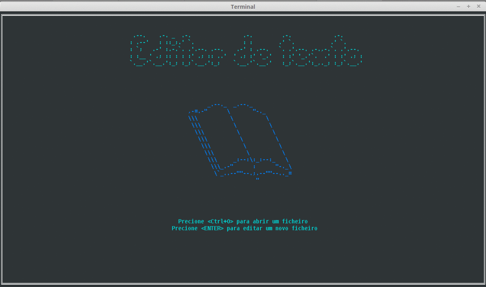

# **Mini editor de texto**

### Laboratório de Programação (Trabalho nº2)

##### Neste trabalho vamos criar um mini editor para ficheiros de texto simples ASCII/UTF-8 usando a biblioteca Lanterna para interfaces textuais.
##### **1ªfase** - implementação de uma estrutura de dados para representação e manipulação de “buffers”
##### **2ªfase** - implementação da interface visual usando a biblioteca Lanterna

###### _André Pereira (201407074), Sara Pereira (201304112)_

>[Faculdade de Ciencias da Universidade do Porto] (https://sigarra.up.pt/fcup/pt/web_page.inicial)
